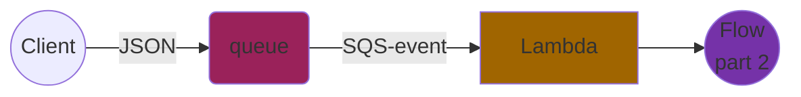
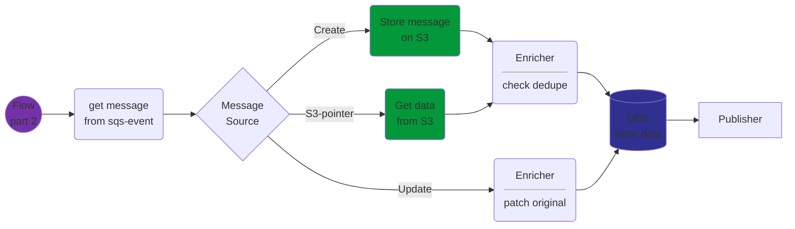

+++ categories = ["Development", "Infrastructure", "Lambda"]
date = "2021-11-12"
description = "Product example explained"
slug = "Product example"
title = "Product example"
+++

# Example : Product

This is an example where the client can  send the information that is needed for the UBE-Model.
There are 3 versions of a message.

- the message has information it is a create-message	
- the message has information it is an update-message	
- the message is an S3 filepointer and will create all the records inside the s3-data.

----------

## Flow part 1 : Receiving messages

The customer sends messages to a sqs queue.

The queue will trigger the lambda, that will receive an sqs-event.

----------

## Flow part 2 : Pipeline

Based on this pipeline, the following actions are done:
- the incoming message is derived for the sqs-event.
- if message source is Create:
  - this message is stored on S3.
- if message source is an S3-pointer:
  - data is downloaded from S3.
- the data is enriched.
- the data is stored in the database.
- the business event is published.

----------
