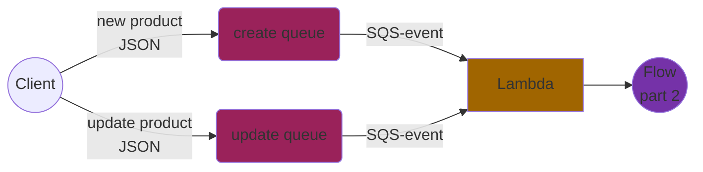
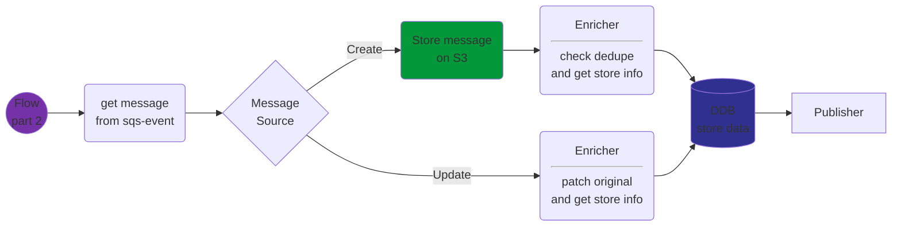

+++ categories = ["Development", "Infrastructure", "Lambda"]
date = "2021-11-12"
description = "Simple Product example explained"
slug = "Simple Product example"
title = "Simple Product Example"
+++

# Example : Simple Product

This is an example where the client can exactly send the information that is needed for the UBE-Model.
In that information is a store-id, which is used to get the store data
and to enrich the simpleProduct with.

----------

## Flow part 1 : Receiving messages

The customer sends messages to a sqs queue.

The queue will trigger the lambda, that will receive an sqs-event

----------

## Flow part 2 : Pipeline

Based on this pipeline, the following actions are done:
- the incoming message is derived for the sqs-event.
- if message source is Create:
  - this message is stored on S3.
- the data is enriched (with the store information).
- the data is stored in the database.
- the business event is published.

----------
